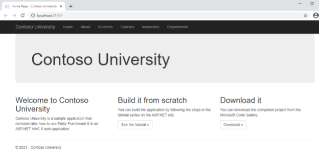

# Deploying a .NET Framework web application to a GKE Cluster with a Windows Server Node Pool 

This tutorial shows you how to replatform the Contoso University web application, a traditional Microsoft ASP.NET Framework MVC + Entity Framework sample that was built with .NET Framework 4.5 and EntityFramework 6, to run in Google Kubernetes Engine (GKE), on Windows Server nodes.

## Enabling Google APIs

In [Cloud Shell](https://shell.cloud.google.com), run the following command:

```bash
gcloud services enable container.googleapis.com artifactregistry.googleapis.com compute.googleapis.com cloudbuild.googleapis.com servicenetworking.googleapis.com
```

This command enables the following APIs in your project:

- Service Networking
- Cloud Build
- GKE
- Artifact Registry
- Compute Engine
- Cloud Build

## Setup Cloud SQL for SQL Server

If you haven't done so already, [create](./README.md#Setup-Cloud-SQL-for-SQL-Server) a Cloud SQL for SQL Server instance to host the Contoso University database, and follow the [steps in the README file](README.md#connect-to-the-database) to create and populate the ContosoUniversity database. 

### Configure private IP for Cloud SQL for SQL Server

GKE uses cluster auto-scaling, meaning that under load your cluster may add new nodes to the cluster. New nodes are added with new external IPs, which makes it hard to keep your authorized networks in Cloud SQL up-to-date. To allow traffic from GKE nodes to your Cloud SQL instance, we recommended that you enable private IP for your Cloud SQL instance.

If you haven't done so already, configure a private IP for your Cloud SQL instance. To learn how to do this, see [Configuring Private IP](https://cloud.google.com/sql/docs/sqlserver/configure-private-ip). Note the private IP of the instance, because you use it later in this tutorial. 

## Create the GKE cluster

In Cloud Shell, create a GKE cluster with a Windows Server 2019 node pool:

```bash
export CLUSTER_NAME=cluster1

gcloud container clusters create $CLUSTER_NAME \
    --enable-ip-alias \
    --num-nodes=1 \
    --zone=us-central1-a \
    --release-channel regular

gcloud container node-pools create windows-2019-ltsc-pool \
    --cluster=$CLUSTER_NAME \
    --image-type=WINDOWS_LTSC_CONTAINERD \
    --windows-os-version=ltsc2019 \
    --no-enable-autoupgrade \
    --zone=us-central1-a \
    --machine-type=n1-standard-2 \
    --num-nodes=1
```

For more information about Windows Server node pools in GKE, see [Creating a cluster using Windows Server node pools](https://cloud.google.com/kubernetes-engine/docs/how-to/creating-a-cluster-windows).

## Get the code

If you plan on building and running the container locally, execute the following commands in a Windows Server 2019 machine that has [Docker](https://cloud.google.com/compute/docs/containers#install_docker) and [git](https://git-scm.com/download/win) installed. 

Alternatively, if you want to build the container image with Cloud Build, stay in Cloud Shell.

Run the following command to download the code that you use in this tutorial:

```bash
git clone --branch start https://github.com/GoogleCloudPlatform/dotnet-migration-sample

cd dotnet-migration-sample 
```

In this tutorial you create several files, including a Docker file and a build instruction file for Cloud Build. If you want to skip the steps for creating the required files, checkout the `gke_windows` branch:
```bash
git checkout gke_windows 
```

## Treat the connection string as a secret
The database connection string contains sensitive information - the user's credentials. It's a security best practice to separate the sensitive information, also known as *secrets*, from the application. In GKE, the secrets for an application are stored in the cluster as a Kubernetes secret and are deployed to the container as either files or environment variables, together with the application. 

1. To reference this secret with no code changes, replace the `connectionStrings` section in the `ContosoUniversity\Web.config` file with the following configuration (copy only the `connectionStrings` line from the following snippet): 

   ```xml
   <configuration>
     ...
     <connectionStrings configSource="secret\connectionStrings.config"/>
     ...
   </configuration>
   ```

1. Create a file named `connectionStrings.config` in the same folder as the `ContosoUniversity.sln` file and add the `connectionStrings` section to the file:

   ```xml
   <connectionStrings>
       <add name="SchoolContext"
          connectionString="Data Source=[INSTANCE_IP];Initial Catalog=ContosoUniversity;User ID=[USER];Password=[PASSWORD];"
          providerName="System.Data.SqlClient" />
   </connectionStrings>
   ```
   Make the following replacements:
   - `[INSTANCE_IP]`: the private IP of your SQL Server instance that you created earlier
   - `[USER]`: the user you created
   - `[PASSWORD]`: the password you set for the user

1. Run the following command to create the Kubernetes secret from the `connectionStrings.config` file:

   ```bash
   kubectl create secret generic connection-strings --from-file=connectionStrings.config
   ```

You use the secret you created later on in this tutorial, when you create the deployment YAML file for the application.

## Create a Docker registry

If you haven't done so already, [create an Artifact Registry repository for Docker](https://cloud.google.com/artifact-registry/docs/repositories/create-repos#docker) in `us-central1` and name it `images`. 

## Create the Windows Container image

To deploy the web application to GKE, you need to create a [Dockerfile](https://docs.docker.com/engine/reference/builder/) that describes how to build the application with MSBuild and how to create the container image, and then build the container image and push it to Artifact Registry.

### Create the Dockerfile
Create a file named `Dockerfile` in the same folder as the `ContosoUniversity.sln` file and set its content:

```dockerfile
# escape=`

FROM mcr.microsoft.com/dotnet/framework/sdk:4.8-windowsservercore-ltsc2019 AS build
WORKDIR /source
COPY ContosoUniversity.sln /source
COPY ContosoUniversity /source/ContosoUniversity

RUN msbuild ContosoUniversity.sln /t:restore /p:RestorePackagesConfig=true
RUN msbuild /p:Configuration=Release `
	/t:WebPublish `
	/p:WebPublishMethod=FileSystem `
	/p:publishUrl=C:\deploy

FROM mcr.microsoft.com/dotnet/framework/aspnet:4.8-windowsservercore-ltsc2019 AS runtime
COPY --from=build /deploy /inetpub/wwwroot

EXPOSE 80
```

The container image runs .NET Framework 4.8. Although the application was written for .NET Framework 4.5, because of the backward compatiblity of .NET Framework, the container will still be able to run the application.

### Optional: Build and test the container locally

If you have Docker installed locally on your Windows Server 2019 machine and you want to test the container locally, see the guidance in this section. 

If you do not want to test the container locally, skip this section.

1. In your machine, build the container:

   ```cmd
   # GKE is not used - Copy the connectionStrings.config file to the secret folder
   md secret
   copy connectionStrings.config secret

   # Store the Project env variable
   gcloud info --format=value(config.project) > __project && set /p PROJECT= < __project && del __project

   # Build the container
   docker build -t us-central1-docker.pkg.dev/%PROJECT%/images/contosouniversity-windows:v1 -f Dockerfile .

   # Run the container
   docker run -it --rm -p 8080:80 -v "%cd%\secret:c:\inetpub\wwwroot\secret" --name contoso-university us-central1-docker.pkg.dev/%PROJECT%/images/contosouniversity-windows:v1
   ```

   You should now be able to launch a browser with [http://localhost:8080](http://localhost:8080) to see the application.

1. Register gcloud as a Docker credential helper:
   ```cmd
   gcloud auth configure-docker us-central1-docker.pkg.dev
   ```
1. Push the container to your private container registry:
   ```cmd
   docker push us-central1-docker.pkg.dev/%PROJECT%/images/contosouniversity-windows:v1
   ```

## Use Cloud Build to build Windows container images

Cloud Build workers are Linux-based and therefore do not support the build of .NET Framework applications. However, to build your application, you can do the following:

1. Use Cloud Build workers to run a script that creates a Windows Server VM with the .NET Framework SDK.
1. Copy the code to the VM.
1. Run `docker build` in the VM to build the container image.
1. Push the container image to your private container registry.

These build steps are available by using the [gke-windows-builder](https://cloud.google.com/kubernetes-engine/docs/tutorials/building-windows-multi-arch-images) builder for Cloud Build. 

Next, you use the `gke-windows-builder` with Cloud Build to build the Windows Server container image.

NOTE: The `gke-windows-builder` is not specific to GKE. Although built by the GKE Windows engineering team, it doesn't use or depend on GKE.  

1. In Cloud Shell, run the following commands to let the Cloud Build service account access to your project:

   ```bash
   export PROJECT_ID=[PROJECT]
   export PROJECT_NUMBER=`gcloud projects describe $PROJECT_ID --format 'value(projectNumber)'`
   gcloud config set project $PROJECT_ID

   export CLOUD_BUILD_SA=$PROJECT_NUMBER@cloudbuild.gserviceaccount.com
   export COMPUTE_SA=$PROJECT_NUMBER-compute@developer.gserviceaccount.com

   gcloud projects add-iam-policy-binding $PROJECT_ID \
      --member=serviceAccount:$CLOUD_BUILD_SA \
      --role='roles/compute.instanceAdmin'

   gcloud projects add-iam-policy-binding $PROJECT_ID \
      --member=serviceAccount:$CLOUD_BUILD_SA \
      --role='roles/iam.serviceAccountUser'

   gcloud projects add-iam-policy-binding $PROJECT_ID \
      --member=serviceAccount:$CLOUD_BUILD_SA \
      --role='roles/compute.networkViewer'

   gcloud projects add-iam-policy-binding $PROJECT_ID \
      --member=serviceAccount:$CLOUD_BUILD_SA \
      --role='roles/storage.admin'

   gcloud projects add-iam-policy-binding $PROJECT_ID \
      --member=serviceAccount:$COMPUTE_SA \
      --role='roles/storage.admin'

   gcloud projects add-iam-policy-binding $PROJECT_ID \
      --member=serviceAccount:$COMPUTE_SA \
      --role='roles/artifactregistry.writer'

   gcloud compute firewall-rules create allow-winrm-ingress \
      --allow=tcp:5986 \
      --direction=INGRESS
    ```

   Replace `[PROJECT]` with your project ID.

1. Create a file named `cloudbuild.yaml` in the same folder as the `ContosoUniversity.sln` file and set its content:

   ```yaml
   timeout: 3600s
   steps:
   - name: 'us-docker.pkg.dev/gke-windows-tools/docker-repo/gke-windows-builder:latest'
     args:
     - --versions
     - 'ltsc2019'
     - --container-image-name
     - 'us-central1-docker.pkg.dev/$PROJECT_ID/images/contosouniversity-windows:v1'
   ```

1. Delete the `connectionStrings.config` file.

  ```bash
  rm connectionStrings.config
  ```

1. Use Cloud Build to build the Windows Server container image and push the image to Container Registry:

   ```bash
   gcloud builds submit
   ```

## Deploy to GKE
Now that the container image is ready, you can create the deployment in GKE and test the web application to verify it is working and able to query the SQL Server database.

1. Create a file named `deploy.yaml` in the same folder as the `ContosoUniversity.sln` file and set its content:

   ```yaml
   apiVersion: apps/v1
   kind: Deployment
   metadata:
     labels:
       app: contosouniversity
     name: contosouniversity
   spec:
     replicas: 1
     selector:
       matchLabels:
         app: contosouniversity
     template:
       metadata:
         labels:
           app: contosouniversity
       spec:
         containers:
         - image: us-central1-docker.pkg.dev/${PROJECT_ID}/images/contosouniversity-windows:v1
           imagePullPolicy: IfNotPresent
           name: contosouniversity-container
           volumeMounts: 
           - name: connection-strings
             mountPath: "/inetpub/wwwroot/secret"
             readOnly: true
           ports:
           - containerPort: 80
             protocol: TCP
         nodeSelector:
           kubernetes.io/os: windows
         volumes:
         - name: connection-strings
           secret:
             secretName: connection-strings
         restartPolicy: Always
   ---
   apiVersion: v1
   kind: Service
   metadata:
     name: contosouniversity-service
   spec:
     selector:
       app: contosouniversity
     ports:
       - protocol: TCP
         port: 80
         targetPort: 80
     type: LoadBalancer
   ```

   The `connection-strings` secret that you created before is mounted to the `secret` directory in the container, under the `C:\inetpub\wwwroot` directory, where the application is deployed.

   We don't recommend specifying a mount directory outside the path of the application, because the Internet Information Services (IIS) web server might not have permissions to read the file, which will result in an HTTP 500 error.  

1. Run the following command to deploy the Contoso University web application to GKE:
   ```bash
   envsubst < deploy.yaml | kubectl apply -f -
   ```

   The script uses the `envsubst` tool to substitute `${PROJECT_ID}` in the `deploy.yaml` file with your project ID. The output of that script is applied to your GKE cluster. 

   You can see the relevant placeholder in the following `deploy.yaml` file:

   ```yaml
   containers:
   - image: us-central1-docker.pkg.dev/${PROJECT_ID}/images/contosouniversity-windows:v1
   ```

1. Wait for the pod to show as `RUNNING`:
   ```bash
   watch kubectl get pods
   ```

   Kubernetes copies the application's container image to the Windows Server node. The container image is several GBs, and this process can take several minutes to finish. 

1. Run the following command to get the IP address for the deployment:
   ```bash
   kubectl get svc contosouniversity-service -o=jsonpath="{.status.loadBalancer.ingress[0].ip}"
   ```

## Test the application
Confirm the application functions as desired.

1. Browse to `http://[SERVICE-IP]`. Replace `[SERVICE-IP]` with the IP of the service you previously retrieved.

1. Verify you see the following home page:

   

1. Verify the application can access the database by selecting one of the tabs, for example, **Departments**.
