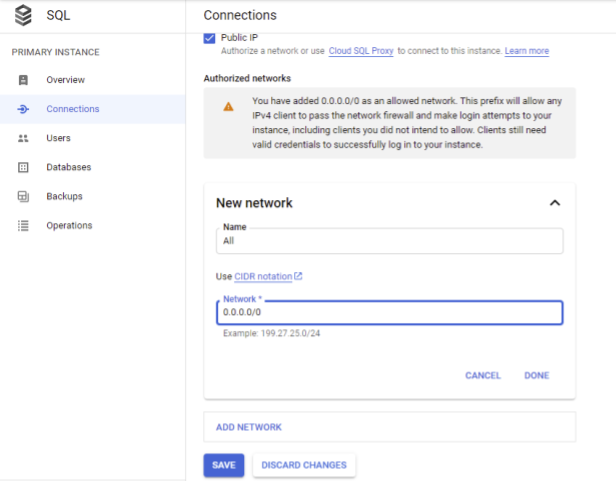
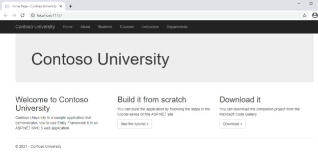
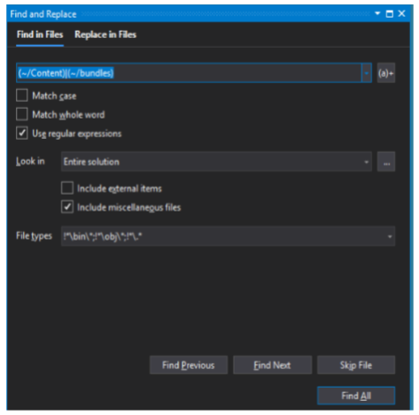
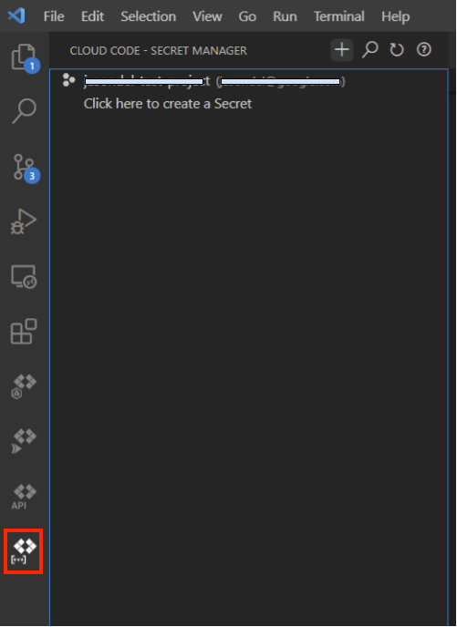
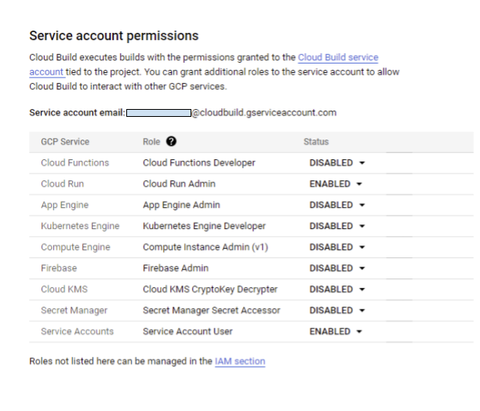

# Migrating ASP.NET MVC to ASP.NET Core MVC on Google Cloud

This tutorial shows you how to migrate [Contoso University](https://docs.microsoft.com/aspnet/mvc/overview/getting-started/getting-started-with-ef-using-mvc/creating-an-entity-framework-data-model-for-an-asp-net-mvc-application), a traditional Microsoft ASP.NET Framework MVC + Entity Framework sample that was built with .NET Framework 4.5 and EntityFramework 6.  In this tutorial, you migrate the Contoso University application to .NET 5 and run it in a Linux container on [Google Cloud Run](https://cloud.google.com/run), a fully serverless environment. You also use [Cloud SQL for SQL Server](https://cloud.google.com/sql-server), a managed Microsoft SQL Server 2017 database in Google Cloud. The migrated Contoso University application uses Google Diagnostics and Cloud Logging for ASP.NET Core as well as Google Secret Manager. This tutorial also and demonstrates how you can use Cloud Build to build the container and automatically deploy it to Cloud Run.

This tutorial provides end-to-end guidance on how to migrate the Contoso University application to .NET 5, including the specific changes that need to be applied to the application's original ASP.NET MVC code. For more detailed guidance about migrating from ASP.NET to ASP.NET Core, see the [Microsoft documentation](https://docs.microsoft.com/aspnet/core/migration/proper-to-2x/?view=aspnetcore-5.0).

### Table of Contents
* [Prerequisites](#Prerequisites)
* [Setup](#Set-up-the-sample) 
* [Migrate](#Migrate)
* [Refactor](#Refactor)
* [Using .NET 5 Configuration](#Using-NET-5-Configuration)
* [Deploying to Google Cloud](#Deploying-to-Google-Cloud)
* [Using Google Secret Manager](#Using-Google-Secret-Manager)
* [Adding Google Cloud Logging & Monitoring](#Adding-Cloud-Logging-and-Cloud-Monitoring)
* [Putting it all together](#Putting-it-all-together)

## Prerequisites

1. You must have access to [Visual Studio 2019](https://visualstudio.microsoft.com/vs) – either download and install the free Community edition, or if you have a licesnse for Visual Studio, then any of the licensed editions.

1. (Optional) [Install Docker](https://docs.docker.com/docker-for-windows/install) on your local machine. If you can't install Docker in your environment, there is a workaround later in this tutorial.

1. Install [.NET 5 SDK](https://dotnet.microsoft.com/download/dotnet/5.0)

1. Download and install the Google Cloud SDK following these [instructions](https://cloud.google.com/sdk/docs/install#windows).

## Set up the sample

Either [download the original Microsoft sample](https://webpifeed.blob.core.windows.net/webpifeed/Partners/ASP.NET%20MVC%20Application%20Using%20Entity%20Framework%20Code%20First.zip) and unzip it to a local directory, or clone this repository and checkout the `start` tag:

```cmd
git clone https://github.com/jjdelorme/ContosoUniversity

git checkout start
```

### Enabling Google APIs

If you've not already done so, make sure to enable the following APIs in your project. In Cloud Shell, use the following command:

```bash
gcloud services enable containerregistry.googleapis.com run.googleapis.com compute.googleapis.com cloudbuild.googleapis.com secretmanager.googleapis.com
```

### Setup Cloud SQL for SQL Server

In this section, you set up the Google Cloud SQL for SQL Server instance.

1. [Create an instance](https://cloud.google.com/sql/docs/sqlserver/create-instance).  For the purposes of this tutorial you can use the SQL Server 2017 Express Edition which is free to license.  For this tutorial, you put all resources in the `us-central1` region.  If you prefer to use a different region, make sure to change that in all region in this tutorial.

1. [Add a user](https://cloud.google.com/sql/docs/sqlserver/create-manage-users) to connect to the database.    

1. Allow access to your Cloud SQL instance:
    1. Accessing the instance from a GCE VM and Cloud Run: Follow the [instructions](https://cloud.google.com/sql/docs/sqlserver/configure-private-ip) to configure a private IP for your Cloud SQL instance. Note the instance's private IP, as you use it later in this tutorial.  

    1. Accessing from your own machine (from the internet): Make sure that the IP address that you want to connect to the database from is added to your [authorized networks](https://cloud.google.com/sql/docs/sqlserver/configure-ip#console). Alternatively, for the purposes of this tutorial, you can allow all public IPs (0.0.0.0/0) to connect, as shown in the following screenshot:
    

### Connect to the database

1. Open the `ContosoUniversity.sln` solution file with Visual Studio 2019.

1. Using the Cloud SQL Server IP address, user and password you created preceding, modify your connection string in the `Web.config` file:

   ```XML
   <connectionStrings>
     <add name="SchoolContext" connectionString="Data Source=[INSTANCE_IP];Initial Catalog=ContosoUniversity;User ID=[USER];Password=[PASSWORD];" providerName="System.Data.SqlClient" />
   </connectionStrings>
   ```

   For the [INSTANCE_IP], use either the SQL Server instance's private or public IP address, according to where you are running the code from. For example, if you are running from your local machine, use the instance's public IP address. 

1. In Visual Studio, open the Package Manager Console from the **View** menu -> **Other Windows** -> **Package Manager Console**. Enter the following command:

   ```cmd
   PM> update-database
   ```

This creates the schema and seeds the database with data automatically using Entity Framework and the `DAL\SchoolInitializer.cs` class.

### Test the application 

Confirm the application builds and functions as desired before starting the migration.  
1. In Visual Studio 2019, press `Ctrl+F5` to build and run the project. 

1. You see the following home page:


1. Verify the application can access the database by selecting one of the tabs, for example, **Departments**.

You are now ready to migrate to application from .NET Framework to .NET 5.

If you want to first test the .NET Framework web application in a Windows container on GKE, refer to the [GKE tutorial](GKE.md).

## Migrate

In this section, you use the [.NET Upgrade Assistant](https://dotnet.microsoft.com/platform/upgrade-assistant/) to automate some steps of the migration to .NET 5. This will get you about 80% of the way there for this tutorial application. This automation is also a good starting point for most .NET Framework to .NET 5 upgrades. 

1. Close your Visual Studio instance

1. Open a command prompt in the solution folder where you extracted the sample, for example, `c:\repos\ContosoUniversity\`

1. Install the .NET Upgrade Assistant and dependents:
    ```cmd
    dotnet tool install -g try-convert
    dotnet tool install -g upgrade-assistant
    ```

1. Run the upgrade assistant:
    ```cmd
    upgrade-assistant upgrade ContosoUniversity.sln --non-interactive --skip-backup
    ```

    The output of the Upgrade Assistant is the converted .NET 5 project.  A `upgrade-assistant.clef` file contains a log of the changes.

1. Run the following commands to remove unused assemblies and update packages to their recent version:
    ```cmd
    dotnet add package Newtonsoft.Json
    dotnet remove reference System.Net
    ```

## Refactor

In this section, you make some manual changes to get the application to enable you to build under .NET 5. At this point, we recommend that you switch to [Visual Studio Code](https://code.visualstudio.com/) which is much lighter weight, open source IDE for developing in .NET Core. However, you can continue to use Visual Studio if you choose.

### Remove **App_Start\\\*.*** and **Global.asax**

The downloaded source code directory structure should resemble the following tree. The root `\` of the directory contains the `ContainerUniversity.sln` solution file and the project directory is `.\ContosoUniversity\`:

```cmd
.
..
├── ContosoUniversity.sln
├── ContosoUniversity
│   ├── ContosoUniversity.csproj
│   ├── Global.asax
│   ├── Global.asax.cs
│   └── App_Start
│       └── BundleConfig.cs
│       ├── FilterConfig.cs
│       └── RouteConfig.cs
│   ├── Scripts
│   ├── Content
│   └── ...
|   ...

```

To use ASP.NET Core, you must remove all the files from the `ContosoUniversity\App_Start` directory as well as `ContosoUniversity\Global.asax*` files.

[Bundling and minification](https://docs.microsoft.com/en-us/aspnet/core/client-side/bundling-and-minification?view=aspnetcore-5.0) changed in ASP.NET Core, so you need to remove the file `ContosoUniversity\App_Start\BundleConfig.cs`.  To replace it you use the `BuildBundlerMinifier` nuget package to bundle and minify at build time.

1. Add the `BuildBundlerMinifier` package:
    ```cmd
    cd ContosoUniversity
    
    dotnet add package BuildBundlerMinifier    
    ```

1. Add a new file in the project directory `ContosoUniversity\bundleconfig.json` with the following contents to instruct `BuildBundlerMinifier` to create the necessary bundled files in the `wwwroot` directory at build time.  
    ```json
    [
        {
            "outputFileName": "wwwroot/css/styles.css",
            "inputFiles": [
                "Content/**/!(*.min).css"
            ]
        },
        {
            "outputFileName": "wwwroot/js/jquery.js",
            "inputFiles": [
                "Scripts/jquery-1.10.2.js",
                "Scripts/jquery-1.10.2.intellisense.js"
            ]
        },
        {
            "outputFileName": "wwwroot/js/bs-bundle.js",
            "inputFiles": [
                "Scripts/bootstrap.js",
                "Scripts/respond.js"
            ]
        },
        {
            "outputFileName": "wwwroot/js/modernizr.js",
            "inputFiles": [
                "Scripts/modernizr-2.6.2.js"
            ]
        }
    ]
    ```
    
1. Remove `@Scripts.Render` and `@Styles.Render` references (`-` lines below) from all `.cshtml` files and replace with the `+` lines below.  VS Code has built in support for regex in Find (`CTRL-F`) then press `ALT+R` to use regular expression mode and search for `(~/Content)|(~/bundles)`.  If you use Visual Studio it can be helpful to use `Find` dialog like this:
    

    ```diff
    - @section Scripts {
    -    @Scripts.Render("~/bundles/jqueryval")
    - }
    + <script src="~/js/jqueryval.js"></script>
    ```
    ```diff
    - @Styles.Render("~/Content/css")
    + <link href="~/css/styles.css" rel="stylesheet" />
    ```
    ```diff
    - @Scripts.Render("~/bundles/modernizr")
    + <script src="~/js/modernizr.js"></script>
    ```
    ```diff
    - @Scripts.Render("~/bundles/jquery")
    + <script src="~/js/jquery.js"></script>
    ```
    ```diff        
    - @Scripts.Render("~/bundles/bootstrap")
    + <script src="~/js/bs-bundle.js"></script>        
    ```

1. Delete `ContosoUniversity\App_Start\BundleConfig.cs` if you didn't already.

Routing and middleware in ASP.NET Core is configured in the new `ContosoUniversity\Startup.cs` file that was added by the .NET Upgrade Assistant which is documented in [App startup in ASP.NET Core](https://docs.microsoft.com/en-us/aspnet/core/fundamentals/startup?view=aspnetcore-5.0).

5. Delete `ContosoUniversity\App_Start\RouteConfig.cs` and `ContosoUniversity\App_Start\FilterConfig.cs`.

1. Delete `ContosoUniversity\Global.asax` and `ContosoUniversity\Global.asax.cs`.  See [this](https://docs.microsoft.com/aspnet/core/migration/proper-to-2x/?view=aspnetcore-5.0#globalasax-file-replacement) for more information.
    
### Pagination

The sample application uses the `PagedList.Mvc` library which you must replace with `PagedList.Core.Mvc`.
1. Replace the package
    ```cmd
    del "ContosoUniversity - Backup.csproj"

    dotnet remove package PagedList.Mvc

    dotnet add package PagedList.Core.Mvc
    ```

1. In the `ContosoUniversity\Controllers\StudentController.cs` controllers replace the `using` reference:
    ```diff
    - using PagedList;
    + using PagedList.Core;
    ```

1. Update the `ContosoUniversity\Views\Student\Index.cshtml` file to change the references:
    ```diff
    - @model PagedList.IPagedList<ContosoUniversity.Models.Student>
    - @using PagedList.Mvc;
    + @model PagedList.Core.IPagedList<ContosoUniversity.Models.Student>
    + @using PagedList.Core.Mvc;
    ```

1. Add the PagedList tag helper to the `ContosoUniversity\Views\_ViewImports.cshtml` file:
    ```diff
    @addTagHelper *, Microsoft.AspNetCore.Mvc.TagHelpers
    + @addTagHelper *, PagedList.Core.Mvc
    ```

1.  Replace the `PagedListPager` component:
    ```diff    
    - @Html.PagedListPager(Model, page => Url.Action("Index",
    -    new { page, sortOrder = ViewBag.CurrentSort, currentFilter = ViewBag.CurrentFilter })) 
    + <pager class="pager-container" list="@Model" asp-action="Index" asp-controller="Student" />     
    ```

### Return Results

ASP.NET MVC Core uses different return result objects for the controller's action methods. Because there are many of these objects scattered throughout the `ContosoUniversity\Controllers\` classes, to replace all malformed return results, we recommend that you look at the build errors table for your IDE. Look for errors in controllers action methods that are because of an unknown return type: 

```diff
-                return new StatusCodeResult(HttpStatusCode.BadRequest);
+                return new BadRequestResult();
```
and: 

```diff
-                return HttpNotFound();
+                return new NotFoundResult();
```

### **TryUpdateModel** to **TryUpdateModelAsync**
The `TryUpdateModel` method is replaced by an `async` method in .NET 5.  To use this method, there are several changes you need to make to each of the controllers including adding a using, changing the method to return `Task<ActionResult>` and waiting for the result, for example:

```diff
+using System.Threading.Tasks;
...
-        public ActionResult EditPost(int? id)
+        public async Task<ActionResult> EditPost(int? id)

-            if (TryUpdateModel(courseToUpdate, "",
-               new string[] { "Title", "Credits", "DepartmentID" }))
+            // Note that you do not need to include the field names:
+            if (await TryUpdateModelAsync(courseToUpdate))
             ...
```

### **Bind** attribute 
You must make minor change in the `Bind` attribute in each of the controllers to remove the `Include=` parameter from the `Bind` attribute, for example:

```diff
-        public ActionResult Create([Bind(Include = "CourseID,Title,Credits,DepartmentID")]Course course)
+        public ActionResult Create([Bind("CourseID,Title,Credits,DepartmentID")]Course course)
```        
Because each of these is slightly different, it's best to search in your IDE for `[Bind(Include` and manually edit each attribute.

### **SelectList**

The `SelectList` object is now part of the `Microsoft.AspNetCore.Mvc.Rendering` namespace, so you must update the `using` directive to the new namespace in every controller where `SelectList` is used, namely in the `ContosoUniversity/Controllers/CourseController.cs` and `ContosoUniversity/Controllers/DepartmentController.cs` files:

```diff
+using Microsoft.AspNetCore.Mvc.Rendering;
...
        // GET: Department/Create
        public ActionResult Create()
        {
            ViewBag.InstructorID = new SelectList(db.Instructors, "ID", "FullName");
            return View();
        }
```

## Using .NET 5 Configuration

In .NET 5, [configuration in ASP.NET Core](https://docs.microsoft.com/aspnet/core/fundamentals/configuration/?view=aspnetcore-5.0) isn't read from the `Web.config` configuration file, so you must move your connection string over to use one of the pluggable configuration providers which gives you more flexibility. However, the amount of flexibility will vary depending on the environment that you deploy the application to.

### Add a connection string to **appsettings**

1. Open the `appsettings.Development.json` file and copy your connection string from `Web.config` as follows:

    ```diff
    {
    "Logging": {
        "LogLevel": {
        "Default": "Information",
        "Microsoft": "Warning",
        "Microsoft.Hosting.Lifetime": "Information"
        }
    -  }
    +  },
    +  "ConnectionStrings": {
    +    "SchoolContext": "Data Source=[INSTANCE_IP];Initial Catalog=ContosoUniversity;User ID=[USER];Password=[PASSWORD];"
    +  }
    +}
    ```

1. ASP.NET Core [configures app behavior](https://docs.microsoft.com/aspnet/core/fundamentals/environments?view=aspnetcore-5.0) based on the runtime environment using an environment variable.  Set the `ASPNETCORE_ENVIRONMENT` environment variable to `Development` so that it will load the `appsettings.Development.json` file:
    ```cmd
    set ASPNETCORE_ENVIRONMENT=Development
    ```
1. Delete the `Web.config` file.

### Use ASP.NET MVC Core Dependency Injection for configuration

The best pattern to use a common service like the database context in ASP.NET Core is to use [Dependency Injection](https://docs.microsoft.com/aspnet/core/fundamentals/dependency-injection?view=aspnetcore-5.0). 

1. Add a constructor to the `SchoolContext` class in the `ContosoUniversity\DAL\SchoolContext.cs` file, with the connection string as a parameter.
   ```diff
   +        public SchoolContext(string connectString) : base(connectString) {}
   ```

1. To add the database context to the service container, add the following code to the `ConfigureServices` method in the `ContosoUniversity\Startup.cs` file:
   ```diff
   + using ContosoUniversity.DAL;
     ...
        {
          options.UseMemberCasing();
        });

   +    services.AddScoped<SchoolContext>(_ => 
   +      new SchoolContext(Configuration.GetConnectionString("SchoolContext"))
   +      );
        }
   ```

1. Change each of the `ContosoUniversity\controllers` to consume this injected service.  Repeat this pattern for each controller as demonstrated with `StudentController`:
   ```diff
    public class StudentController : Controller
    {
   -    private SchoolContext db = new SchoolContext();
   +    private SchoolContext db = null;
   +
   +    public StudentController(SchoolContext db)
   +    {
   +        this.db = db;
   +    }
   ```
   In each of the controller classes, make sure you change the name of the new constructor method to resemble the name of the class.

### Test the .NET 5 version

The application should now compile and run successfully as a .NET 5 application. To build and launch the migrated .NET 5 application, run the following command from the `ContosoUniversity\` directory:
```cmd
dotnet run
```
You see the following output, which shows the application listening on ports 5000 & 5001:
```cmd
info: Microsoft.Hosting.Lifetime[0]
      Now listening on: http://localhost:5000
info: Microsoft.Hosting.Lifetime[0]
      Now listening on: https://localhost:5001
info: Microsoft.Hosting.Lifetime[0]
      Application started. Press Ctrl+C to shut down.
info: Microsoft.Hosting.Lifetime[0]
      Hosting environment: Production
info: Microsoft.Hosting.Lifetime[0]
      Content root path: C:\repos\ContosoUniversity\ContosoUniversity
```

If for some reason you can't use one of these ports, an easy alternative is to instruct the `dotnet` command to run on port 3333 instead:
```cmd
dotnet run -- --urls=http://localhost:3333
```

You should now have your fully migrated .NET 5 application up and running again. The application should be connected to Google Cloud SQL for SQL Server just as the .NET Framework version was. Go ahead and poke around in the application to test the functionality more thoroughly.

## Deploying to Google Cloud

Another benefit of moving to .NET 5 is that you can now run the application in a lightweight Linux container.  With Linux containers you can avoid the *it works on my machine* paradigm by encapsulating all of your dependencies in a small, portable format that can be run anywhere that can host a Docker container, including Kubernetes or fully serverless platforms like [Cloud Run](https://cloud.google.com/run).

### Create the Dockerfile

The next step is to create a Dockerfile which runs in a [.NET Docker container](https://docs.microsoft.com/dotnet/architecture/microservices/net-core-net-framework-containers/official-net-docker-images) created by Microsoft.

Create the `Dockerfile` file in the root solution directory. This directory is also where the `ContosoUniversity.sln` file resides:

```dockerfile
FROM mcr.microsoft.com/dotnet/sdk:5.0 AS build
WORKDIR /source
COPY ./ContosoUniversity /source
RUN dotnet publish -r linux-x64 --self-contained true -c Release -o /deploy

FROM mcr.microsoft.com/dotnet/runtime-deps:5.0 AS runtime

WORKDIR /app
COPY --from=build /deploy .

# Default port for Cloud Run
ENV ASPNETCORE_URLS="http://0.0.0.0:8080"

ENTRYPOINT ["/app/ContosoUniversity"]
```

In this step you use a Docker [multi-stage build](https://docs.docker.com/develop/develop-images/multistage-build/).  This guarantees that the build environment is always the same.  The output of the `build` stage is a [self-contained](https://docs.microsoft.com/dotnet/core/deploying/#publish-self-contained) executable that does not require .NET 5 to be installed, further reducing the image size and startup time.  The `runtime` stage copies only the runtime components necessary and sets a default URL to listen on as an environment variable.  The `ENTRYPOINT` is the name of the self-contained executable that was generated in the `build` stage.  

### Build and run the container
If you have Docker [installed](https://docs.docker.com/docker-for-windows/install/) on your local machine you can build and start the container with the following commands from the solution directory where you created the `Dockerfile` file:

```cmd
docker build -t contosouniversity:v1 -f Dockerfile .

docker run -it contosouniversity:v1 -p 8080:8080
```

This command will run the application and expose port 8080 to the `localhost`, so that you can launch a browser at `http://localhost:8080` on your local machine to test.  

### Using Cloud Build

Rather than running Docker locally, you can use the managed [Cloud Build](https://cloud.google.com/build) service to build the container and automatically push it to your Google Container Registry.

1. To enable Cloud Run to access your SQL Server instance, you need to configure the application's connection string with the instance's private IP address. If you already configured this, then you can skip this step. If you used the SQL Server instance's public IP address in your connection string, open the `appsettings.Development.json` file and change the IP address of the SQL Server instance to the instance's private IP address.

1. Get your Google Cloud Project ID using the `gcloud` tool, for example:
    ```cmd
    gcloud config list

    [compute]
    region = us-central1
    [core]
    account = xyz@example.com
    project = my-sample-project
    ```
    Don't worry if the project or region are not listed for you.  If you haven't previously set your default project, log in to the [Google Cloud Console](https://console.cloud.google.com) and create your first project or get the name of an existing project.

1. Submit your artifacts to cloud build and tag the docker image. Replace `[PROJECT_ID]` with your project ID:
    ```cmd
    gcloud builds submit --tag gcr.io/[PROJECT_ID]/contosouniversity:v1
    ```
    Your complete Docker build now runs in the cloud and you should see the output of the build printed to your console while it runs.

### Deploying to Cloud Run

Now that you've built your container and published it to Google Container Registry, you can deploy the application to Cloud Run.

1. Create a [Serverless VPC Access connector](https://cloud.google.com/run/docs/configuring/connecting-vpc#create-connector) to enable your Cloud Run service to connect to your Cloud SQL instance through your VPC. Configure the connector with the following settings:
   * Name: `contoso-university`
   * Region: `us-central1`

1. Run the following commands to deploy the application to Cloud Run and enable everyone to access it:

    ```cmd
    gcloud run deploy contosouniversity --image gcr.io/[PROJECT_ID]/contosouniversity:v1 --platform managed --update-env-vars ASPNETCORE_ENVIRONMENT=Development --region us-central1 --allow-unauthenticated --vpc-connector contoso-university

    gcloud run services add-iam-policy-binding contosouniversity --member="allUsers" --role="roles/run.invoker" --region us-central1 
    ```

    Replace `[PROJECT_ID]` with your own project name. 

1. Copy the service URL from the output and open the URL in a browser. Click the **Students** tab to verify the application is able to query the SQL Server database.

For a complete tutorial on Cloud Run with C#, see [Build and deploy a C# .Net Core service](https://cloud.google.com/run/docs/quickstarts/build-and-deploy/c-sharp).

## Using Google Secret Manager

While your application is now deployed and running, one issue is that your database connection string in `appsettings.json` is stored in plain text and is being shipped around with your source code. To fix this, in this section, you use [Secret Manager](https://cloud.google.com/secret-manager) to securely store the connection string. If you are using Visual Studio Code at this point, you can use the [Cloud Code extension](https://cloud.google.com/code/docs/vscode/install) to easily create and manage secrets.

Follow the next steps to create the secret, according to whether you use Visual Studio code or not.

NOTE: Next, you create a secret, but are not asked to remove the existing connection string from the `appsettings.Development.json` file. This is so that you can test the application locally while developing. Later in this tutorial, you configure it so that the `appsettings.Development.json` file is excluded from the build process and from the remote git repository, and is only available locally on your machine.

### Creating a secret using Visual Studio Code

1. Copy the `connectionStrings` block from `appsettings.Development.json`.

1. Install the extension and click on the **Cloud Code - Secret Manager** icon:
    

1. Click to create a Secret and name it `connectionstrings` (use lowercase letters). 

1. In the **Enter a value** text box, add a leading and trailing curly braces and then paste the text you copied between the two curly braces. The value should resemble the following:

   ```json
   {
      "ConnectionStrings": {
        "SchoolContext": "Data Source=[INSTANCE_IP];Initial Catalog=ContosoUniversity;User ID=[USER];Password=[PASSWORD];"
      }
   }
   ```

1. Click **Create Secret**.

### Creating a secret using the Google Cloud Console

1. Copy the `connectionStrings` block from `appsettings.Development.json`.

1. Follow the [instructions](https://cloud.google.com/secret-manager/docs/creating-and-accessing-secrets#create) for creating a secret in the Google Cloud Console. Use the following information for the secret:
    * **Name**: `connectionstrings` (use lowercase letters).
    * **Secret value**: Add a leading and trailing curly braces and paste the text you copied between the two curly braces. The value should resemble the following:

    ```json
    {
        "ConnectionStrings": {
            "SchoolContext": "Data Source=[INSTANCE_IP];Initial Catalog=ContosoUniversity;User ID=[USER];Password=[PASSWORD];"
        }
    }
     ```
1. Click **Create Secret**.

### Using the secret in the web application

There are multiple ways to read the secrets from your application, including using the [SDK API directly](https://cloud.google.com/secret-manager/docs/creating-and-accessing-secrets#secretmanager-create-secret-csharp). However, Cloud Run has [built-in support for Secrets](https://cloud.google.com/run/docs/configuring/secrets) which mount into the container as files at runtime. 

In this section, you use Cloud Run to mount the connection string to: `/app/secret/appsettings.json` and add code for ASP.NET Core to load configuration files from the `secret` folder if it exists.

1. Add the following code to the `ContosoUniversity\Program.cs` file:

    ```diff
            public static IHostBuilder CreateHostBuilder(string[] args) =>
                Host.CreateDefaultBuilder(args)
    +                .ConfigureAppConfiguration(AddSecretConfig)
                    .ConfigureWebHostDefaults(webBuilder =>
                    {
                        webBuilder.UseStartup<Startup>();
                    });
    ```

1. Still in the `ContosoUniversity\Program.cs` file, add the implementation of `AddSecretConfig`:

    ```csharp
            private static void AddSecretConfig(HostBuilderContext context, 
                IConfigurationBuilder config) 
            {
                const string secretsPath = "secrets";

                var secretFileProvider = context.HostingEnvironment.ContentRootFileProvider
                    .GetDirectoryContents(secretsPath);

                if (secretFileProvider.Exists)
                    foreach (var secret in secretFileProvider)
                        config.AddJsonFile(secret.PhysicalPath, false, true);
            }
    ```

1. Give the `Secret Manager Secret Accessor` role to the Cloud Run service account. For instructions, see [the Cloud run documentation](https://cloud.google.com/run/docs/configuring/secrets#access-secret).
    
    NOTE: By default, Cloud Run revisions execute as the [Compute Engine default service account](https://cloud.google.com/compute/docs/access/service-accounts#default_service_account).

## Adding Cloud Logging and Cloud Monitoring
In this section, you centralize logging and monitoring. It's common for Cloud Native applications to adopt the [Twelve-Factor App](https://12factor.net/logs) pattern and treat logs as streams. ASP.NET Core by default [writes logs](https://docs.microsoft.com/aspnet/core/fundamentals/logging/?view=aspnetcore-5.0) to `stdout` as desired. By default, all Cloud Run logs written to `stdout` by the container will be available in [Cloud Logging](https://cloud.google.com/logging). However, [structured logging](https://cloud.google.com/logging/docs/structured-logging) allows you to make more sense of the logs, and enables easier querying, with machine and human readability.

There are several ways to get ASP.NET to automatically structure the logs without changing your logging code. In this section you will enable structured logging using the `Google.Cloud.Diagnostics.AspNetCore` package.

1. Add the package to your project
    ```cmd
    dotnet add package Google.Cloud.Diagnostics.AspNetCore
    ```

1. Modify `ContosoUniversity\Program.cs` to use the new library:
    ```diff
    +using Google.Cloud.Diagnostics.AspNetCore;
    
    ...
    
            public static IHostBuilder CreateHostBuilder(string[] args) =>
                Host.CreateDefaultBuilder(args)
                    .ConfigureAppConfiguration(AddSecretConfig)
                    .ConfigureWebHostDefaults(webBuilder =>
                    {
    +                   if (webBuilder.GetSetting("ENVIRONMENT") == "Production")
    +                   {
    +                       webBuilder.UseGoogleDiagnostics();
    +                   }
                        webBuilder.UseStartup<Startup>();
                    });
    ```

   The application uses Cloud Logging only for production environments, such as when the application is deployed to Cloud Run. The `ENVIRONMENT` setting is controlled by the `ASPNETCORE_ENVIRONMENT` environment variable that you set earlier. If you don't set this variable, ASP.NET Core uses the value `Production` [By default](https://docs.microsoft.com/en-us/aspnet/core/fundamentals/environments?view=aspnetcore-5.0#environments).

## Putting it all together

At this stage, you're now using Cloud Build to build and publish your container to Container Registry, Secret Manager to store the connection string, and Cloud Run to run your application. To pull all of these actions together, in this section you create the `cloudbuild.yaml` file to automate your build and deployment. Cloud Build can even be configured to run when you push to your git repository, for example to enable continuous integration and continuous deployment (CI/CD).  

1. Ensure you have the proper permissions for Cloud Build to deploy to Cloud Run. For instructions on how to enable Service Account permissions, see the [Deploying to Cloud Run How-to Guide](https://cloud.google.com/build/docs/deploying-builds/deploy-cloud-run#before_you_begin):


1. Alternatively, open Cloud Shell and set permissions with the following script:
    ```bash
    PROJECT_ID=`gcloud config list --format 'value(core.project)' 2>/dev/null`

    PROJECT_NUMBER=`gcloud projects describe $PROJECT_ID --format='value(projectNumber)'`

    gcloud projects add-iam-policy-binding $PROJECT_ID \
        --member "serviceAccount:$PROJECT_NUMBER@cloudbuild.gserviceaccount.com" \
        --role roles/run.admin

    gcloud iam service-accounts add-iam-policy-binding \
        $PROJECT_NUMBER-compute@developer.gserviceaccount.com \
        --member "serviceAccount:$PROJECT_NUMBER@cloudbuild.gserviceaccount.com" \
        --role "roles/iam.serviceAccountUser"
    ```

1. Create `cloudbuild.yaml` in the solution directory, as shown in the following code:

    ```yaml
    steps:
    # Build the container image
    - name: 'gcr.io/cloud-builders/docker'
      args: ['build', '-t', 'gcr.io/$PROJECT_ID/contosouniversity:$BUILD_ID', '.']
    # Push the container image to Container Registry
    - name: 'gcr.io/cloud-builders/docker'
      args: ['push', 'gcr.io/$PROJECT_ID/contosouniversity:$BUILD_ID']
    # Deploy container image to Cloud Run
    - name: 'gcr.io/google.com/cloudsdktool/cloud-sdk'
      entrypoint: gcloud
      args:       
      - 'beta'
      - 'run'
      - 'deploy'
      - 'contosouniversity'
      - '--image'
      - 'gcr.io/$PROJECT_ID/contosouniversity:$BUILD_ID'
      - '--region'
      - 'us-central1'
      - '--platform'
      - 'managed'
      - '--allow-unauthenticated'
      - '--update-secrets=/app/secrets/appsettings.json=connectionstrings:latest'
      - '--vpc-connector'
      - 'contoso-university'
    images:
    - gcr.io/$PROJECT_ID/contosouniversity:$BUILD_ID
    ```

    Cloud Build will automatically substitute the `$PROJECT_ID` and `$BUILD_ID` when you run it. 
    
1. To prevent the gcloud command from including binaries and other unrequired files in the build process, can create a `.gitignore` file, and set its content to the following:
    ```
    .vscode/
    **/bin/
    **/obj/
    **/wwwroot/
    **/appsettings.Development.json
    *.csproj.user

    # Exclude git history and configuration.
    .git/
    .gitignore
    ```

1. Submit the build from the solution directory:
    ```cmd
    gcloud builds submit
    ```

1. Run the following command to get the newly deployed service URL. Open the URL in a browser and then click the **Students** tab to verify the application is able to query the SQL Server database. 
    
    ```cmd
    gcloud run services describe contosouniversity --region us-central1 --format="value(status.url)"
    ```  

## What's Next?

- Converting to .NET Core too much work for your workload? Check out building a [Windows Container and deploying to GKE](GKE.md) with no code changes.
